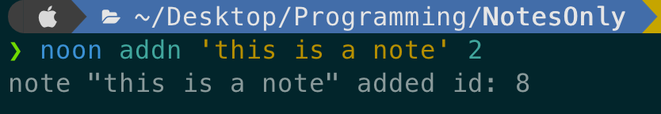

# NotesOnly
### simple CLI note-taking app
### Takes notes directly from your terminal

note-taking = storing single line plain text

This project uses Typer and to store the file a csv file is used (datas.csv)

this program is still very inconvenient to use with long syntaxes(will change in the future)

## Class-feature
The class feature is a way to organize your notes. 
it is a sort of hierarchy you can access/view all
notes in class it has 3 classes; <br>
1. upper  id -> 1
2. middle; id -> 2
3. lower; id -> 3 <br>

Classes are given to notes using there id numbers


# how to setup system-wide noon command
**Note**: in the examples the command `noon` is used, if this is not setup 
running `app.py` with full path from anywhere in computer can be used(very inconvenient)

Ex.
```bash
python ~/desktop/programming/NotesOnly/app.py addn "setup noon" --classid=1
```
---
### In order to setup `noon` command execute the following command
```bash
sudo python app.py
```

# Usage

NotesOnly tool is extremely simple and easy-to-use,
using only simple terminal commands with little parameters.

**containing only 6 functions** <br>
1. [addn](#addn)
2. [deln](#deln)
3. [editn](#editn) 
4. [viewn](#viewn)
5. [viewc](#viewc)
6. [viewa](#viewa)

## addn
Add a new note.

Ex.
```bash
noon addn 'this is a new note' 2
```
this will add a new middle class note

**addn** takes 2 argument: note, classid

if note argument contains white space it has to be covered
with quote character.



## deln
Delete note

Ex.
```bash
noon deln 2
```
this will delete the note with **id number 2**

**deln** takes 1 parameter: note id, deletes the note with
the note id

**Note**: give the index number '00' to delete the last/newest note

to see whats the id of a note [see all notes](#viewa)
or see what you are deleting with [viewn](#viewn)


## editn
Edit note

Ex.
```editn
noon editn 2
```
this will open cli to edit note with the **id number 2**

**editn** takes 1 parameter: note id, edits the note with
the note id

todo!!**add here output images for editn**!! 


## viewn
View a specific note

Ex.
```bash
noon viewn 2
```
this will print the note with the **id number 2**

**viewn** takes 1 parameter: note id, prints the note with
the note id


## viewc
View a specific class

Ex.
```bash
noon viewc 3
```
this will print all the **lower class notes**

**viewc** takes 1 parameter: class id, prints the notes with
the class id

there is only 3 class ids: [Class feature](#Class-feature) 


## viewa
view all the notes

Ex.
```bash
noon viewa
```
this will print all the notes

**viewn** takes no parameter just prints all the notes


# Installation

1. clone this repository
```
git clone https://github.com/ThDag/NotesOnly.git 
```
thats it (i think)

-Taha Dağıstanlı
