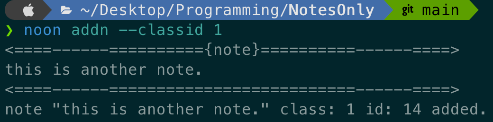
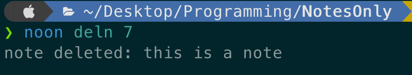
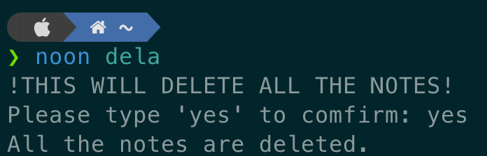
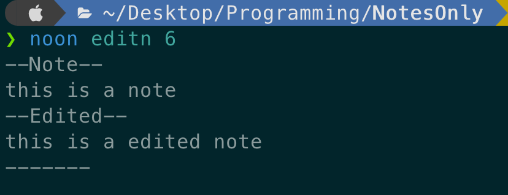
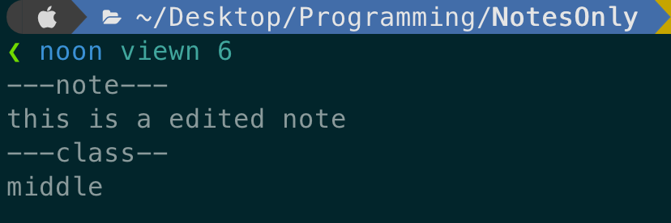
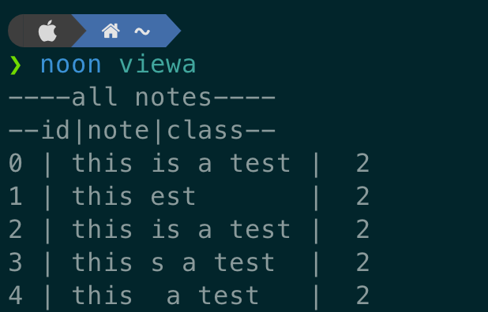
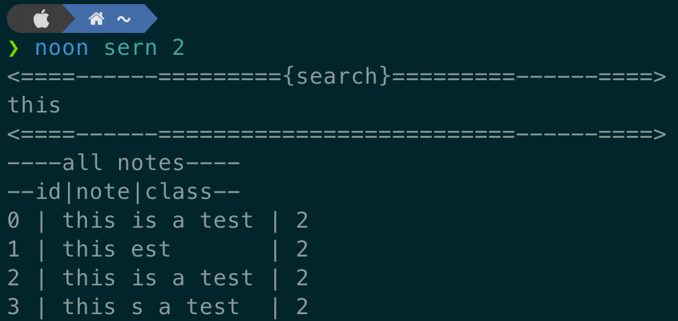

<!-- TOC --><a name="notesonly"></a>
# NotesOnly

<!-- TOC --><a name="simple-cli-note-taking-app"></a>
### simple CLI note-taking app
<!-- TOC --><a name="takes-notes-directly-from-your-terminal"></a>
### Takes notes directly from your terminal

note-taking = storing plain single-line text

this app is mainly intended for any OS that doesn't have GUI and solves the struggle of storing
text for future usage.

This project uses Typer and to store the file a csv file is used (datas.csv)

<!-- TOC start  -->

- [NotesOnly](#notesonly)
    + [simple CLI note-taking app](#simple-cli-note-taking-app)
    + [Takes notes directly from your terminal](#takes-notes-directly-from-your-terminal)
- [Installation](#installation)
- [how to setup system-wide `noon` command](#how-to-setup-system-wide-noon-command)
- [Usage](#usage)
  * [Class-feature](#class-feature)
  * [Commands](#commands)
  * [addn](#addn)
  * [deln](#deln)
  * [dela](#dela)
  * [editn](#editn)
  * [viewn](#viewn)
  * [viewc](#viewc)
  * [viewa](#viewa)
  * [sern](#sern)

<!-- TOC end -->

<!-- TOC --><a name="installation"></a>
# Installation

1. clone this repository
```
git clone https://github.com/ThDag/NotesOnly.git 
```
thats it (i think)

<!-- TOC --><a name="how-to-setup-system-wide-noon-command"></a>
# how to setup system-wide `noon` command
just run the `setup.py` file 
```bash
sudo python setup.py
```
---
**Note**: in the examples the command `noon` is used, if this is not setup 
running `app.py` with full path from anywhere in computer can be used (very inconvenient)

Ex.
```bash
python ~/desktop/programming/NotesOnly/app.py addn 
```

<!-- TOC --><a name="usage"></a>
# Usage

<!-- TOC --><a name="class-feature"></a>
## Class-feature
The class feature is a way to organize your notes. 
it is a sort of hierarchy you can access/view all
notes in class it has 3 classes; <br>
1. upper  id -> 1
2. middle; id -> 2
3. lower; id -> 3 <br>

Classes are given to notes using there id numbers

<!-- TOC --><a name="commands"></a>
## Commands

NotesOnly tool is extremely simple and easy-to-use,
using simple terminal commands with little parameters.

**containing only 6 functions** <br>
addn, deln, dela, editn, viewn, viewc, viewa, sern

<!-- TOC --><a name="addn"></a>
## addn
Add a new note.

Ex.
```bash
noon addn 2
```
> then enter the note in the interactive note entry window

this will add a new middle class note

**addn** takes 1 argument: classid




> if class id is not spesified it will present with a interactive class id selection window

<!-- TOC --><a name="deln"></a>
## deln
Delete note

Ex.
```bash
noon deln 2
```
this will delete the note with **id number 2**

**deln** takes 1 parameter: note id, deletes the note with
the note id. 
*Note*: note id can take any number of ids seperated with white space
it will delete all the listed notes.

**Note**: give the index number '00' to delete the last/newest note

to see whats the id of a note [see all notes](#viewa)
or see what you are deleting with [viewn](#viewn)




<!-- TOC --><a name="dela"></a>
## dela
Delete all the notes

```bash
noon dela
```
this will activate a interactive window asking for confirmation to delete all the notes
then it will proceed to delete all the notes.

**dela** takes no arguments. But it asks for confirmation before deleting all the notes.



<!-- TOC --><a name="editn"></a>
## editn
Edit note

Ex.
```editn
noon editn 2
```
this will open interactive window to edit note with the **id number 2**

**editn** takes 1 parameter: note id, edits the note with
the note id



<!-- TOC --><a name="viewn"></a>
## viewn
View a specific note

Ex.
```bash
noon viewn 2
```
this will print the note with the **id number 2**

**viewn** takes 1 parameter: note id, prints the note with
the note id



<!-- TOC --><a name="viewc"></a>
## viewc
View a specific class

Ex.
```bash
noon viewc 3
```
this will print all the **lower class notes**

**viewc** takes 1 parameter: class id, prints the notes with
the class id

there is only 3 class ids: [Class feature](#Class-feature) 


<!-- TOC --><a name="viewa"></a>
## viewa
view all the notes

Ex.
```bash
noon viewa
```
this will print all the notes

**viewa** takes no parameter just prints all the notes



<!-- TOC --><a name="sern"></a>
## sern
search for notes

```bash
noon sern 1 2
```
> then enter the query you want to search in interactive window
This will search in the 1 and 2 classes.

**sern** takes 1 parameter; class_id is the classes to filter.
It can be given multiple or none. If given none it will show from all classes.
In Interactive menu it asks for query to search then  prints the results.



-Taha Dağıstanlı

